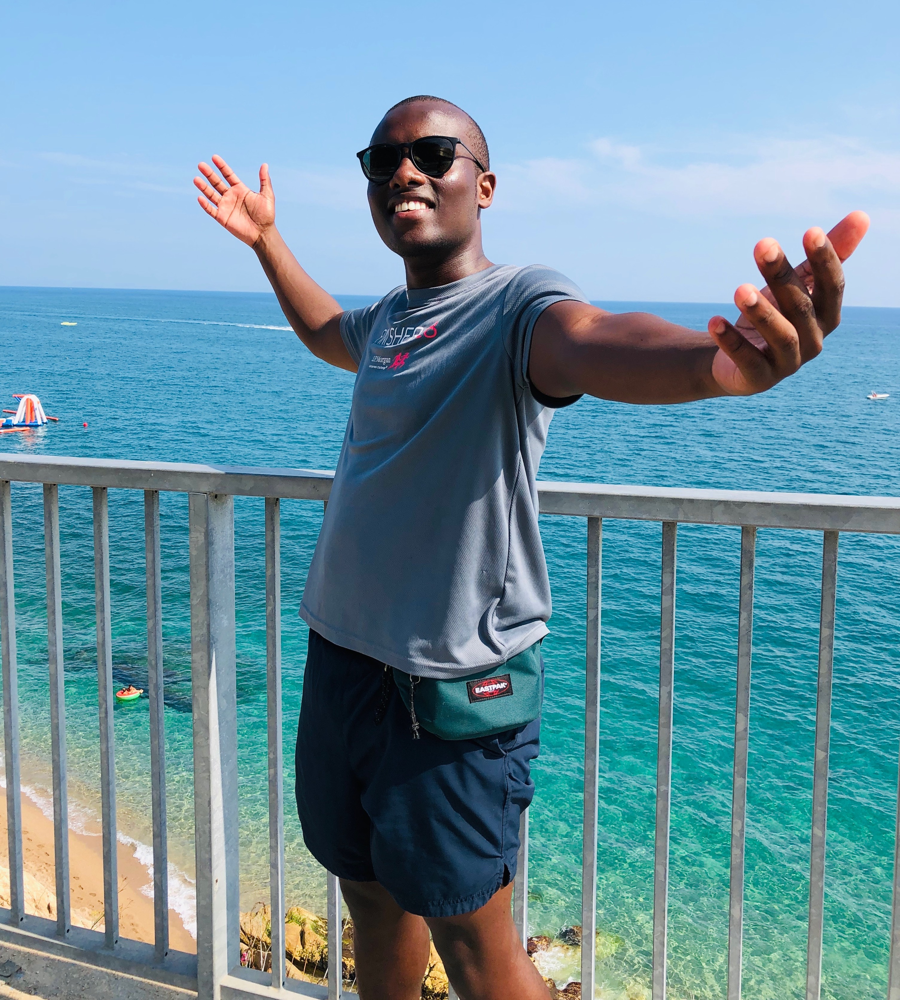

[_My Aubameyang celebration impression_](https://t.resfu.com/media/img_news/afp_en_2f664c243fe923b41c68f089f593320cfcdca747.jpg?size=776x&q=60)

Hi there!

I'm Paul, I'm 24 and I describe myself as a curious, energetic, complex being navigating through this thing called life. I currently reside in London working as a software engineer for [Bulb](https://www.bulb.co.uk). For more information about what I do exactly, have a look at my [CV](./paulwawerucv2.pdf).

I love to travel, and I was recently in [Callela](https://www.google.com/maps/place/Calella,+Barcelona,+Spain/@41.6163727,2.6356562,14z/data=!3m1!4b1!4m5!3m4!1s0x12bb39b04518c207:0x56ef369d70456b28!8m2!3d41.6134346!4d2.6535552), a seaside city on th the Costa del Maresme, in Spain. That is a photo of me by the sea!

This blog is comprised of my opinions and my opinions alone. I'll post stuff about tech, travelling, or random things that tickle my fancy. Feel free to read and share!

You can easily contact me via my [LinkedIn](https://www.linkedin.com/in/paul-waweru-35652594/) and view my projects on [Github](https://github.com/paulmbw).

That's all, enjoy! 👻