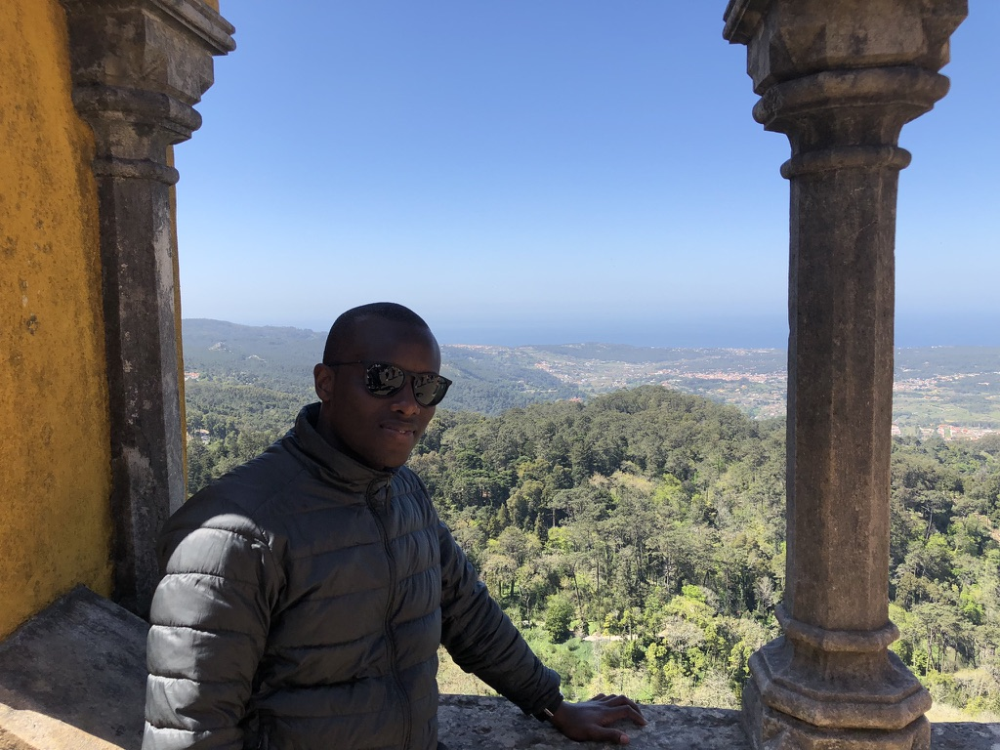
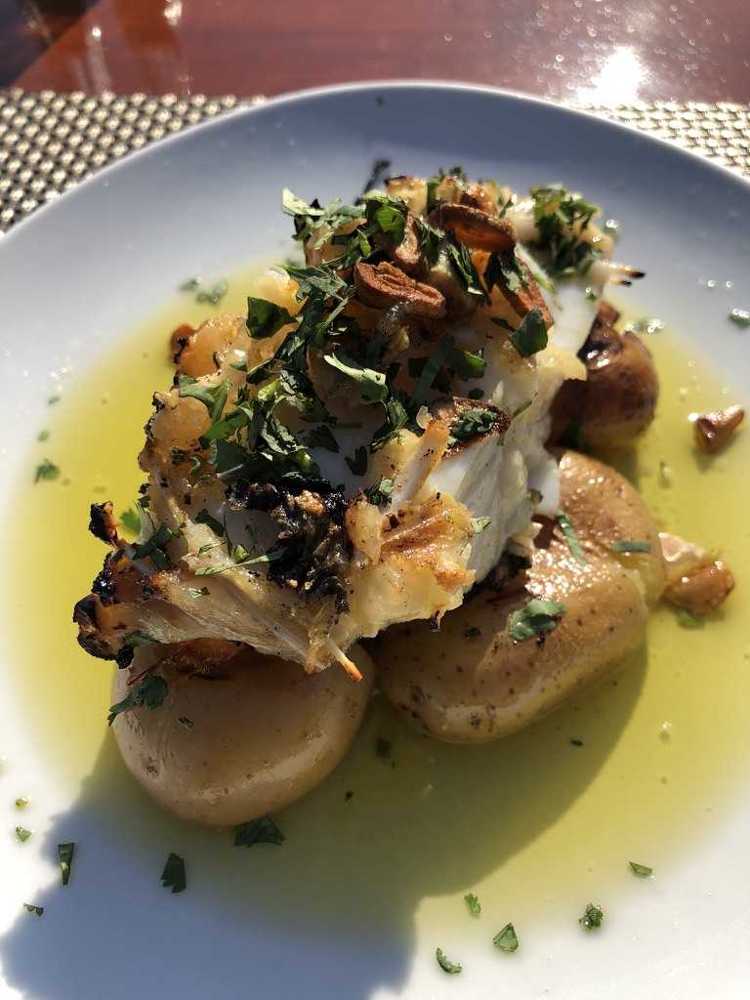
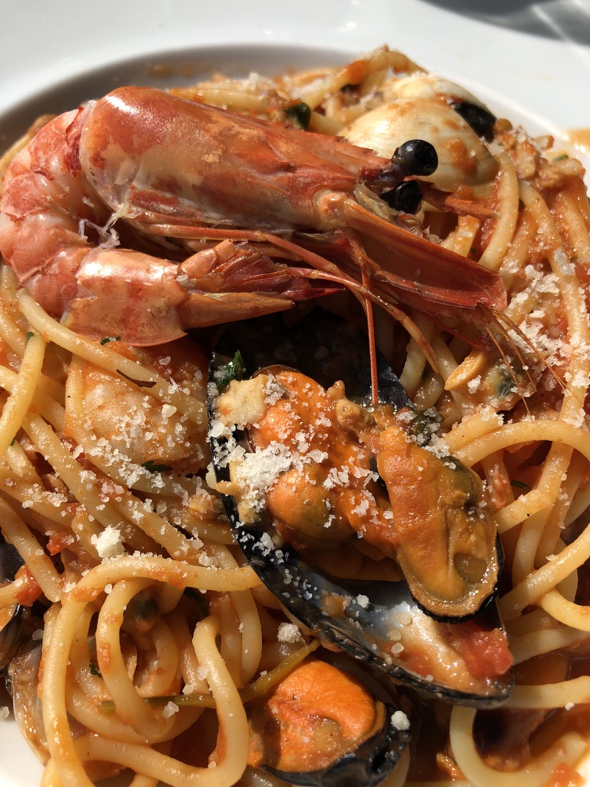
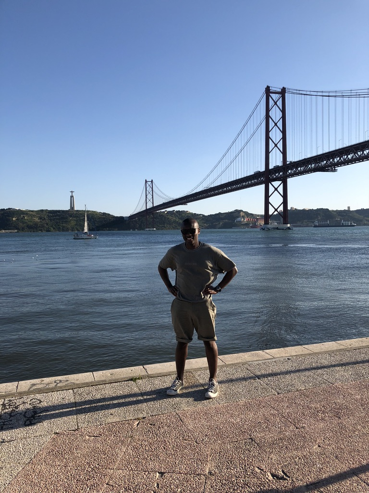

## Firstly, why?

You're probably already thinking, why on earth would you go on holiday alone?! Don't you have any family or friends to take with you?! 😂

Travelling is something I'm passionate about, and having visited places such as San Francisco, New York (for work), Boston, Norway, Croatia, Switzerland, France, and now Portugal, I can't get enough. However, travelling alone was something I had thought about for some time but never had the courage to take the plunge. As I was in between moving jobs, I decided it was time to face my fears. So, I did it! I booked a week long trip to Lisbon where I did not know a single soul. Not one person. And what an experience it has been. I'll start off by discussing what has been personally my biggest challenge, moving onto learning to love my own company, safety concerns, and finally some tips if you ever decide to venture out abroad alone.

**Beyond the comfort zone**

My first challenge, of course, is moving away from my comfort zone. A lot of the places I've already visited had been with either relatives and friends, or visiting them in those places. Getting around was pretty easy. Portugal did not fall under this bracket; I literally did not know anyone there, and this might be a daunting thought for some. I tackled this challenge by constantly reminding myself that I had no one else to trust but me! I had ensure I had my own back, and this started of by **having a plan**. Prior to the trip, I had a document listing all the places I would visit on what day, for instance, I'd visit Lisbon Castle and Praça do Comércio on Monday, take the train to Sintra on Tuesday etc. I even went as far as listing all the places to eat and bars to visit during the evening (a link to my holiday plan can be found later in the post). **A fail to plan is most definitely a plan to fail**.

The next challenge I was soon to face was speaking to  people I'd never met. This was big for me. Naturally, I'm quite reserved and tend to deflect attention away from myself (if I can help it), but this trip taught me that sometimes it's okay to open up to new people. Small talk, which I previously found  tremendously awkward, is now something I've got a good grasp with (I think!) through practicing whilst I was out there. It's actually not that bad haha! I was fortunate to meet new people and it all started out like this:

- new person: "is this the queue for Lisbon Castle?"
- me: "yes, you're in the right place"
- new person: "ahh, brilliant, long queue, huh?"
- me: "yeah, hope we don't spend all day here. Where are you from?"
- new person: "I'm from Romania, but I live and work in the UK! You?"

And just like that! A new friendship is born.

**Learning to enjoy my own company**

I've always loved my own company. A lot of the time social interactions are fun, but I often look forward to the time when I get home and I have some time to myself. Whilst out in Lisbon, I had to get used to the reality of being alone for most of the day, every day for a week. Alone in the sense where I wasn't always actively in a conversation with anyone, or walking around with a partner/relative/friend. I was truly on my own, but as time went I got used to the feeling, and I started to enjoy my time out there. You really need to know how to enjoy your own company to make travelling alone a success. The great part of it all was I prioritised  everything and made decisions for myself. From where I was going, to what I was having for lunch; it was all up to me! Speaking of lunch, here is a dish of Bacalhau (dried and salted cod) I had in Cascais which was incredible:

I couldn't help but also share this amazing dish called Spaghetti Fruitti Di Mare, which is a mixture of tomato sauce, prawns, clams and mussels! I am big on seafood:

Having significant others, family for friends to travel with is important no doubt. This trip has, however, taught me to love and appreciate myself more. At the end of the day, all you have is yourself! 

**Is Lisbon safe all on your own?**

Quite surprisingly, despite being a lone wolf I did feel incredibly safe (this largely depends on where you go obviously). Lisbon itself is very diverse melting pot of people. I made friends from the UK, Switzerland, Germany, Brazil...the list goes on. A lot of the people I met were very friendly and approachable, which made me feel safe and secure in the area. I also walked around the town late into the night. Most of the streets are well lit, and a lot of the restaurants were still open (this was after midnight). Having said this, I would advise getting an Uber late into the night in any city just in case, but I had a good experience myself.

**Some tips if you're thinking of doing  a solo trip**

So, have I convinced you enough to take the plunge too? If so, here's a compiled list of things I would recommend.  This may already sound pretty obvious, but here it is anyway 🙂:

- **Plan**: ensure you have a detailed plan of what you are planning on doing ([here](https://docs.google.com/document/d/1L5kodwLUCY_-s091cr589HuulHvo8AvzbC0PVm6eQTI/edit?usp=sharing) is mine for some inspiration). I don't mean a list of things you're going to do each and every second of the day, I'm more leaning towards the idea of knowing what to do when you wake up. Not having a plan can lead to idleness and wasting your valuable time abroad.
- **Cash**: do have some spare cash with you whilst travelling. Most of my expenses where made via my Monzo card to help me keep track of them, but there were a few places that only accepted cash, so have some just in case! I spent five days there with €150  which was enough (food is pretty cheap there btw, I was having breakfast which was made up of a ham and toast sandwich, a shot of espresso and an orange juice all for €6! Crazy right?!)
- **Backpack**: have a backpack with you! Carry spare shorts, walking/running shoes for comfort (I walked roughly 114k steps, or 88km in the span of 4 days), and most importantly, BOTTLED WATER! It does get hot out there, so keep hydrated at all times.
- **Have fun**: Don't forget to have a good time. Travelling is meant to be a fun and rewarding experience, so don't take to too seriously!

**Conclusion**

Lisbon has challenged me quite a lot, and I'd like to think I gave it a good fight. I've learned to trust and rely on myself a lot more, to organise myself as best possible, and most importantly, to grow in confidence and strength in, you guessed it, myself. I do hope this post does help you in whatever challenge you're about to face, because everything begins with you!

If you do have any other questions about my experience, please don't hesitate to drop me an [email](mailto:paul.waweru58@gmail.com) . See ya!

