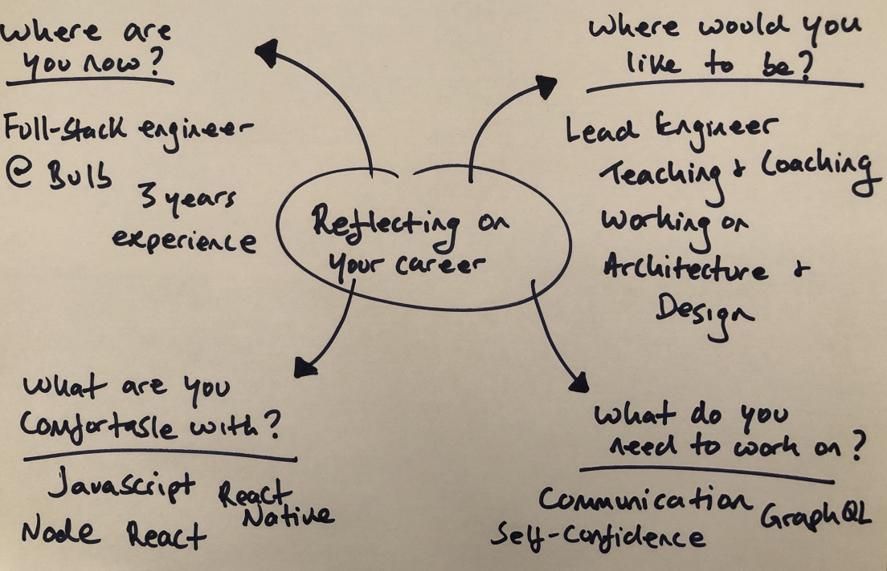

_**4 mins read**_

_Disclaimer: although this post is tailored to my career as a software engineer, it may also apply to whatever role you're working in!_

As well as blogging about technical how-to's and my travelling updates, sharing my thoughts and experiences surrounding my career is something I hope others can benefit from. Today's post focuses on reflecting on your career, asking key questions and the importance of contemplation.

**Visualising your career**

Now and again, I like to ask myself a series of questions to evaluate my career. Visualising how things work help me in my everyday understanding of things, and I recommend writing down your thoughts and ideas. To help with this, I've drawn up a simple diagram with questions and responses about my career:

Here is how I would answer the above questions in depth to provide some inspiration:
- **Where am I now:** I'm currently a full-stack engineer at [Bulb](https://bulb.co.uk) Energy, and I've be there for just over 2 months. I'm currently building applications with React and Typescript ([we're hiring!](https://bulb.co.uk/careers/))
- **Where would I like to be:** Ideally, I would like to learn as much as possible in order to help teach and coach others (whether that's becoming a lead engineer or simply sharing my knowledge). What I enjoy most about working in technology helping out others through sharing what I've learned. I'd also like to get involved in architecting and designing projects.
- **What am I comfortable with:** technology wise, I'm comfortable with a variety of tools including Javascript and Node, React (professionally) and React Native (through personal projects). I'm also comfortable with working closely with others through avenues such as pair-programming and discussing technical solutions. 
- **What do I need to work on:** soft skills such as communication, especially communicating with large audiences and non-technical people. I would also like to build on my self-confidence.

**Importance on reflecting**

The pace at which technology moves is so fast and you can end up getting caught in the drama whilst forgetting your own personal journey. Whilst learning new programming languages and working on different projects can be fun, it's important to take a step back and ask yourself how you're getting on, where you're going and what steps you're taking to get there.

What are some ways that you use to keep track of your career? Please don't hesitate to [email](mailto:paul.waweru58@gmail.com)  me, I'd love to hear!