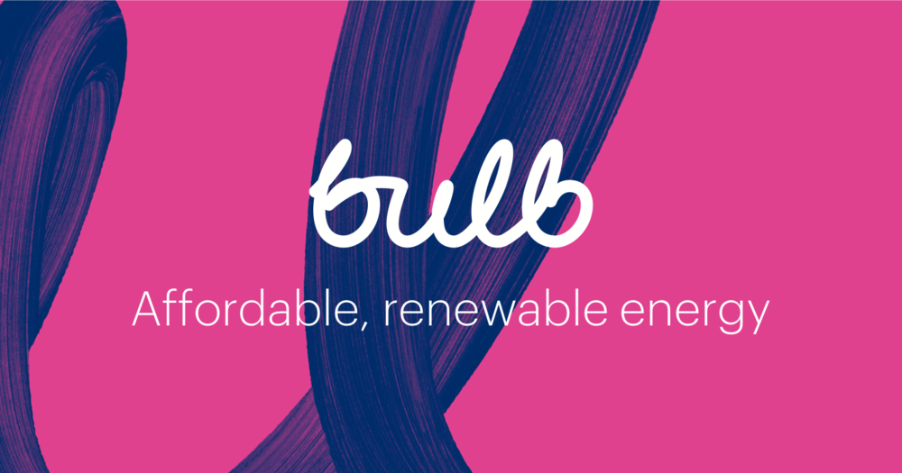

### Our products: Export and the Bulb mobile app
The first product, Export, is primarily aimed at supporting small-scale renewable generation. We’re currently building an application that will pay our members for energy they generate and export back to the grid. We recently wrote a blog post about supporting small-scale renewable generation if you’d like to know more.

The second product mentioned in this post talks about the Bulb mobile app which aims to help our members access and manage their Bulb account on their phone, through features such as submitting meter readings and viewing payment history.

### Two sides of the story
Building applications at Bulb is made up of two parts: frontend, which consists of creating user interfaces and views for our members to interact with. Take for example the Bulb account. Members are able to login and view their account details, submit their gas and electricity meter readings and view their energy usage over the past couple of months. This is all achieved through building frontend components and views for our members to use.

The second part, named the backend, is concerned with what happens behind the scenes. Take for example a member viewing their energy usage. The backend is made up of services that are responsible for fetching all the relevant information needed to show a member's energy usage. This usually consists of reading values from a database, running calculations for a given time period, and predicting usage over the next couple of months.

### Technologies used
The frontend and backend play separate roles in building applications, and thus a variety of tools are used to help work on both. All of our member facing applications use React, which is a user interface library that helps build frontend applications . React comes with an arsenal of ways which help building this, from creating reusable components and handling state, and you can read more about the technology here.

A number of our backend applications use Typescript as a programming language for building services that sit behind our frontend applications. These services hold different kinds of responsibility such as gathering information from other services through API’s, or running important calculations such as calculating how much our members should be paid for energy they generate. 

Some of our applications use GraphQL which is a service used for querying and manipulating data.  This tool is particularly useful as we tend to read to show our members data about their account, and to change data whenever new Bulb accounts get created or their details are updated. 

### Examples
Focusing on the first product mentioned earlier in the post, Export is an application that’s currently in development which will calculate and process payments for the energy our members generate. We’re a small team of developers, QA’s and project managers that are building this application, making use of the technologies mentioned before, including Typescript and Node. Our biggest challenge right now is building for scalability. As our product grows, we’re always keeping in mind how our application will perform under a large user base.
The Bulb mobile app uses a similar piece of technology named React Native which is commonly used for building mobile applications. Other tools such as styled-components (styling React components with CSS), Typescript, Fastlane (for automatic deployments and releases of iOS and Android apps) and Firebase (mobile development platform) help with delivering features of the app. 

The team responsible for building the mobile app recently encountered a bug with the styled-components library which caused the app to crash everytime it was opened. After some investigation, it was identified the root cause of this issue was the use of the CSS property ‘border: none’ which crashed the app.

### We're hiring
If you’re both interested in the technologies we use and you’d like to get involved, take a look at our open positions. We would love to hear from you.