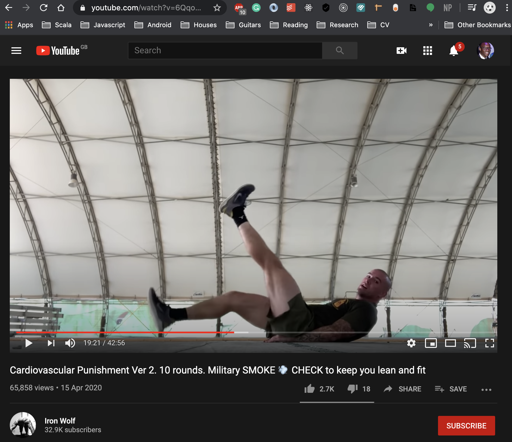

You've probably heard what's going outside, and you've probably been impacted in one way or another. For myself, it's meant working remotely, not being able to go to church for prayers, but also notably not being able to exercise outside as I used to. Typically, this would consist of going to the gym or playing football with friends, which is no longer possible due to social distancing rules in place. It's a strange time for everyone as we've learned to adapt and find alternatives to our usual lifestyle.

On the topic of working out and exercising, my friend Kal and I experimented with working out online. Here, we document our experience and what it was like, challenges we faced and a few ideas on what can be improved.

## The workout

I'm based in London, while [Kal](https://www.linkedin.com/in/kalada-anga/) is based in Lagos, Nigeria. We followed a YouTube video titled [Cardiovascular Punishment Ver 2. 10 rounds. Military SMOKE 💨 CHECK to keep you lean and fit](https://www.youtube.com/watch?v=6QqoSyqckqA&t=912s). Spoiler alert, we did not make it through the what seemed a gruelling 43 minute workout. We did however do 15 minutes...better than nothing, right?!

We used Skype as a means of connecting with each other and had a seperate window with the workout video. It looked something like this:

 

 

## What was great 

What I most enjoyed about this experience was simply sharing it with someone else. I could have easily followed the workout tutorial on my own, but I knew it wouldn't have been the same. I would have lacked the voice to push me to do the last burpee, and to motivate me to keep going. Exercising really does make a difference when you're sharing with someone else.

Kal also had similar thoughts. He expressed how he'd usually become either tired, bored or unmotivated when doing YouTube workouts alone, but having someone to share the workout with really made a difference. To quote Kal:

>  Knowing he  was there motivated me to carry on and generally made me happy to be there. I was excited to do the workout because it felt less like a chore and more like something fun to do with my mate.

## What wasn't great

We had to jump over a few technical hurdles before getting started with the workout. I had initially got set up using an iPad and multitasking with Skype and YouTube. I later realised while being on the Skype call, the camera shuts off once you navigate to a different app, which I thought was quite disappointing. As an alternative, I only used the tablet for the Skype call and used my laptop to follow the workout tutorial. 

Moreover, we also had to ensure we started the video at the same time to be in sync. Kal also had the video opened and we had to essentially click play simultaneously. This worked somewhat well, but there were times where I had noticed I was a few seconds behind. To quote Kal once more:

> While it was mostly a fun experience, it took us a while to get set up. I had issues keeping camera on, and because it wasn't a guided workout video I had to constantly look up at the screen to follow the workout. Otherwise it was a lot of fun and I'd definitely do it again.

## What can be improved

Thinking ahead, working out online using Skype and YouTube could easily become a routine, and it'll also be great fun having more friends on the call. It's exciting to think about what it'd be like if we could seamlessly have more people on the call and have an easy way to follow the workout tutorial together.

Furthermore, a big part of working out includes seeing how much you have improved over a period of time. It would be awesome to be able to track all of the workout tutorials you and your friends have watched, and also earn rewards for completing different workouts.

Kal also suggested a couple of ideas the could have improved this experience:

>It would be great if we had a way to track when the exercise move was about to change. This could be done by the instructor giving us a heads up on the next movement in the exercise. Another way would be if there was some type of countdown time before we switched positions.
>
>It would also be cool if we could choose our own background music to make the experience more upbeat.  
>
>It would have also been better if the routine had short breaks scheduled into it to give us time to rest and have a quick chat during the transitions.

## Conclusion 

All in all, working out has always been a fun and enjoyable experience for myself, and my friend Kal can also attest to this also. The pandemic, however, has forced people to think outside of the box in terms of how they workout, and also how they continue to live their life. I would highly recommend giving it a go. A note for us; perhaps start off with a beginner level workout and avoid any videos titled "cardiovascular punishment" 😅.

What does your quarantine/social distancing exercise routine look like? What are some ways that could make exercising at home better? I would love to [hear](mailto:paul.waweru58@gmail.com) more about your experience. Let me know what you think!

As always, keep safe and keep strong. 

